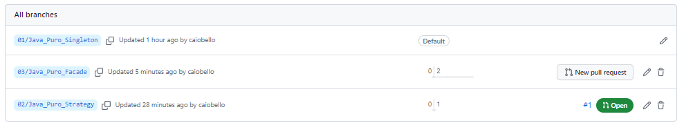

# Tipos de padrões de Projetos com Java

Este projeto demonstra a implementação de diferentes padrões de projeto, como Singleton e Strategy, além de utilizar o padrão Facade para simplificar o acesso a subsistemas complexos.

## Estrutura do Projeto
O projeto está organizado da seguinte forma:

* O pacote one.digitalinnovation.gof.facade contém a classe Facade, que é a fachada responsável por simplificar o processo de migração de um cliente para o sistema de CRM. Ela utiliza as classes CepApi e CrmService do subsistema.
* O pacote one.digitalinnovation.gof.singleton contém as classes relacionadas à implementação do padrão Singleton. São elas:
* SingletonEager: Implementa o Singleton "Apressado", onde a instância é criada no momento da inicialização da classe.
* SingletonLazy: Implementa o Singleton "Preguiçoso", onde a instância é criada somente quando solicitada pela primeira vez.
* SingletonLazyHolder: Implementa o Singleton "Lazy Holder", onde a instância é criada apenas quando necessária, usando uma classe interna estática.
* O pacote one.digitalinnovation.gof.strategy contém as classes relacionadas à implementação do padrão Strategy. São elas:
* Comportamento: Interface que define o comportamento.
* ComportamentoAgressivo, ComportamentoDefensivo e ComportamentoNormal: Implementações concretas do comportamento.
* Robo: Classe que possui um comportamento e permite alterá-lo em tempo de execução.
* O pacote one.digitalinnovation.gof.subsistema contém a classe CrmService, responsável por gravar um cliente no sistema de CRM.
* O pacote one.digitalinnovation.gof.subsistema2 contém a classe CepApi, que simula uma API de consulta de CEP e fornece informações sobre a cidade e o estado associados a um determinado CEP.
* A classe Test contém o método main que exemplifica o uso dos padrões Singleton, Strategy e Facade com os exemplos apresentados.
## Padrões de Projeto
* Singleton
O padrão Singleton é utilizado nas classes SingletonEager, SingletonLazy e SingletonLazyHolder. Ele garante que somente uma instância da classe seja criada e fornece um ponto global de acesso a essa instância.
A classe SingletonEager utiliza a estratégia "Apressada", criando a instância no momento da inicialização da classe. Já a classe SingletonLazy utiliza a estratégia "Preguiçosa", criando a instância somente quando é solicitada pela primeira vez. Por fim, a classe SingletonLazyHolder utiliza a estratégia "Lazy Holder", onde a instância é criada apenas quando necessária, por meio de uma classe interna estática.

* Strategy
O padrão Strategy é utilizado nas classes relacionadas ao comportamento do robô. A interface Comportamento define o contrato para diferentes comportamentos. As classes ComportamentoAgressivo, ComportamentoDefensivo e ComportamentoNormal são as implementações concretas desse contrato. A classe Robo possui uma referência a um objeto de comportamento e permite alterar esse comportamento em tempo de execução.

* Facade
O padrão Facade é utilizado na classe Facade, que fornece uma interface simplificada para o subsistema complexo formado pelas classes CepApi e CrmService. O método migrarCliente da classe Facade recebe o nome e o CEP de um cliente, utiliza a CepApi para recuperar a cidade e o estado associados ao CEP e, em seguida, utiliza o CrmService para gravar o cliente no sistema de CRM.

## Execução
Para executar o projeto, basta executar o método main na classe Test. Ele irá imprimir no console a utilização dos padrões de projeto Singleton, Strategy e Facade com os exemplos apresentados.
